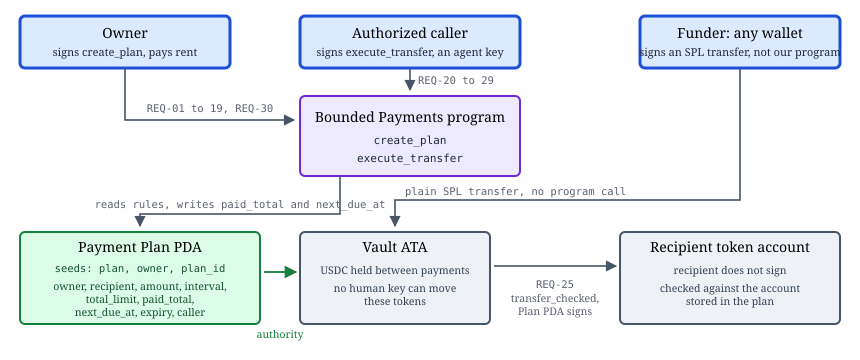
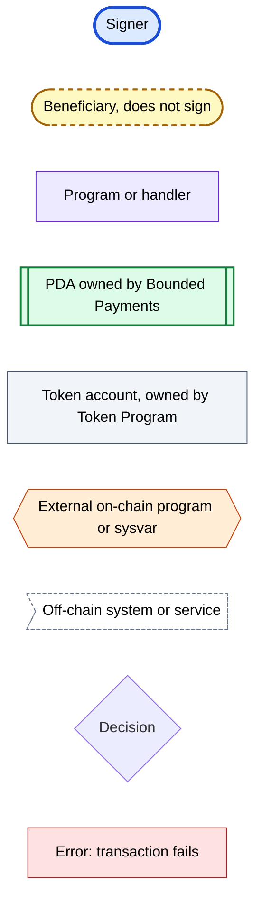
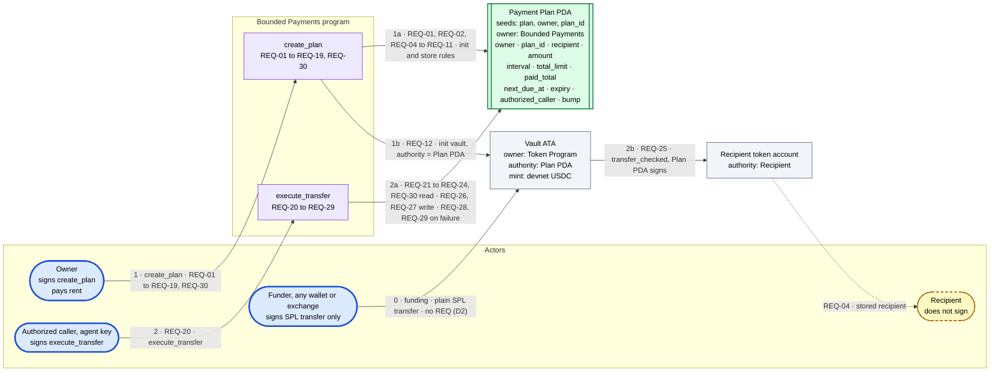
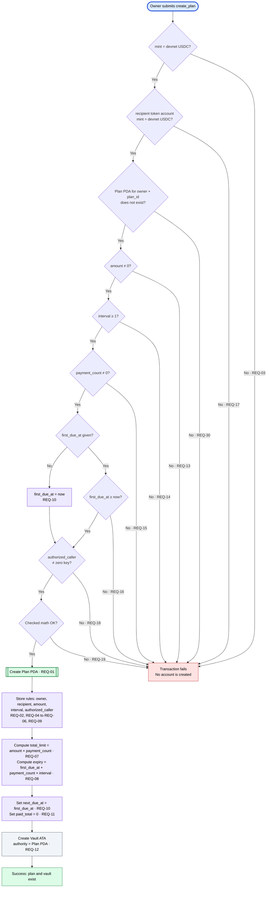
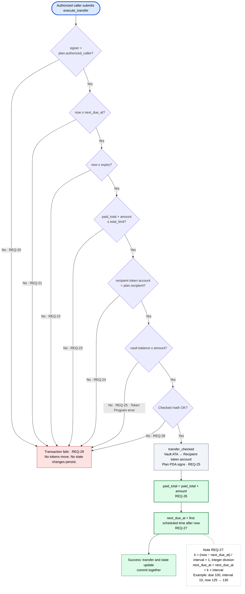
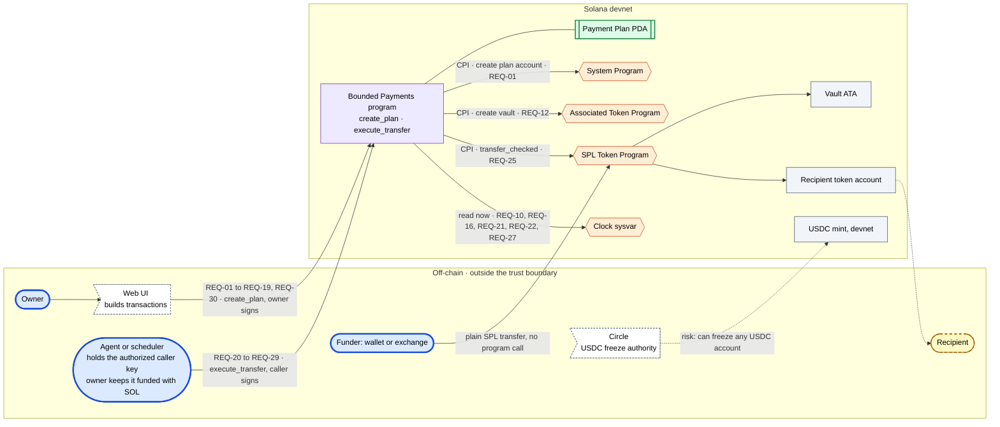

# Bounded Payments: Architecture Diagram & Requirements

Capstone Deliverable 2 · Oct 8, 2026 · @walquer xavier valles ruiz

## 1. Overview

Bounded Payments is a Solana vault that moves funds only when a submitted payment satisfies owner-defined rules. Stage 1 proves this with one recurring transfer, through two Anchor instruction handlers: `create_plan` and `execute_transfer`.

**Problem.** People want software to make routine payments for them. Manual approval for every payment removes the value of delegation. Full wallet access turns one error or one compromised key into a large loss.

**Stage 1 use cases (POC).**

| Use case | Handler | Signer | Pass condition |
| --- | --- | --- | --- |
| UC-1 Create a payment plan | `create_plan` | Owner | A valid plan and its vault exist. Any invalid input creates nothing. |
| UC-2 Execute a due transfer | `execute_transfer` | Authorized caller | A due transfer succeeds. An early, expired, excessive, or unauthorized transfer changes nothing. |

Funding is not a program use case. Any wallet or exchange sends devnet USDC to the vault with a plain SPL Token transfer.

Repository (source of truth): [github.com/ToXMon/bounded-payments](https://github.com/ToXMon/bounded-payments).

## 2. Design decisions

The team made these decisions before writing requirements. Each requirement in Section 4 follows from one or more of them.

| ID | Decision |
| --- | --- |
| D1 | `create_plan` stores one `authorized_caller` key. The owner chooses it (for example, an agent key). That key can only call `execute_transfer`. |
| D2 | Anyone can fund the vault with a plain SPL Token transfer. Funding gives no authority. |
| D3 | The schedule uses Unix time from the Clock sysvar, in seconds, with a fixed `interval`. |
| D4 | A failed or late payment is a missed payment. After a late success, `next_due_at` becomes the first scheduled time after `now`. Maximum one payment per interval. |
| D5 | The token is devnet USDC on the classic SPL Token Program. The mint is a program constant. The program uses Anchor's `TokenInterface`, which accepts this mint today and leaves the Token-2022 move open without a handler change. |
| D6 | `create_plan` creates the vault ATA. The owner pays the rent for the plan and the vault. |
| D7 | `create_plan` rejects every invalid input, because the plan cannot change after creation. |
| D8 | The payment rules are immutable. |
| D9 | `first_due_at` is optional. If the owner gives no value, the first payment is due now. |
| D10 | The owner gives `amount`, `interval`, and `payment_count`. The program computes `total_limit = amount × payment_count` and `expiry = next_due_at + payment_count × interval`. `next_due_at` is `first_due_at`, or `now` when the owner gives no value (REQ-10). The last payment has one full interval to execute. |
| D11 | All arithmetic uses checked math. An overflow fails the transaction. |
| D12 | Stage 1 has two handlers: `create_plan` and `execute_transfer`. |

## 3. Actors and signers

Three actors sign. The recipient never signs. No protocol-level administrator exists in Stage 1.

| LOI category | Actor | Signs | Can | Cannot |
| --- | --- | --- | --- | --- |
| Direct actor | Owner | `create_plan` | Define all payment rules. Choose the authorized caller. | Change a plan after creation (Stage 1). |
| Direct actor | Authorized caller (agent key) | `execute_transfer` | Submit a due transfer. Decide when to submit. | Change rules, choose the amount or recipient, withdraw the vault. |
| Direct actor | Funder (any wallet or exchange) | SPL Token transfer, not a program handler | Add USDC to the vault. | Change rules or gain any authority. |
| Beneficiary | Recipient | Does not sign | Receive USDC. | Trigger a payment. |
| Administrator | Owner, for his own plan only | `create_plan` | Set the rules once. | Administer other plans. |
| Stakeholder | Team | No handler | Holds the program upgrade authority on devnet. | Move plan funds. |
| Stakeholder | Circle (USDC issuer) | No handler | Freeze any USDC token account, including the vault. | Move plan funds. |
| Trigger | Agent or scheduler (off-chain event) | Does not sign | Cause the authorized caller to submit an instruction. | Bypass any on-chain check. |

Outside the trust boundary: the agent or scheduler process, the web UI. These systems can submit transactions. They cannot bypass the program checks.

## 4. Atomic requirements

Stage 1 has 30 requirements: REQ-01 to REQ-19 and REQ-30 for `create_plan`, REQ-20 to REQ-29 for `execute_transfer`. Each has one action and one testable condition. One use case = one atomic state transition = one Anchor instruction handler.

### UC-1 `create_plan` (signer: Owner)

Inputs: `plan_id: u64`, `amount: u64`, `interval: i64`, `payment_count: u64`, `first_due_at: Option<i64>`, `authorized_caller: Pubkey`, recipient token account.

| REQ | The program shall | Test |
| --- | --- | --- |
| REQ-01 | Create one plan PDA with seeds `["plan", owner, plan_id]`. | Read plan. The address derives from those seeds with the canonical bump. |
| REQ-02 | Store the owner. | Read plan. |
| REQ-03 | Reject a mint that is not the devnet USDC mint. | Other mint fails. |
| REQ-04 | Store the recipient token account. | Read plan. |
| REQ-05 | Store the amount. | Read plan. |
| REQ-06 | Store the interval in seconds. | Read plan. |
| REQ-07 | Compute and store `total_limit = amount × payment_count`. | 10 × 3 stores 30. |
| REQ-08 | Compute and store `expiry = next_due_at + payment_count × interval`. | First due 100, interval 10, count 3 stores 130. No first due, now 100, interval 10, count 3 stores 130. |
| REQ-09 | Store the authorized caller. | Read plan. |
| REQ-10 | Set `next_due_at` to `first_due_at`, or to `now` when the owner gives no value. | Both cases. |
| REQ-11 | Set `paid_total` to 0. | Read plan. |
| REQ-12 | Create the vault ATA with the plan PDA as authority. | Vault authority = plan PDA. |
| REQ-13 | Reject an amount of 0. | Fails. |
| REQ-14 | Reject an interval of 0 or less. | 0 and -1 fail. |
| REQ-15 | Reject a payment count of 0. | Fails. |
| REQ-16 | Reject a given `first_due_at` before `now`. | Past value fails. |
| REQ-17 | Reject a recipient token account with a mint that is not devnet USDC. | Other mint fails. |
| REQ-18 | Reject the zero key as authorized caller. | Fails. |
| REQ-19 | Reject any arithmetic overflow. | Very large count or interval fails. |
| REQ-30 | Reject `create_plan` when the plan PDA for these seeds already exists. | Second create with the same owner and `plan_id` fails; the first plan is unchanged. |

REQ-30 is numbered last so the `execute_transfer` range keeps its ids. It belongs to `create_plan`.

### UC-2 `execute_transfer` (signer: Authorized caller)

| REQ | The program shall | Test |
| --- | --- | --- |
| REQ-20 | Reject a signer that is not the stored authorized caller. | Wrong key fails. |
| REQ-21 | Reject a request when `now < next_due_at`. | Early call fails. |
| REQ-22 | Reject a request when `now > expiry`. | Late call fails. |
| REQ-23 | Reject a request when `paid_total + amount > total_limit`. | Call after the last payment fails. |
| REQ-24 | Reject a recipient token account that is not the stored recipient. | Other account fails. |
| REQ-25 | Transfer the stored amount from the vault to the recipient with `transfer_checked`, signed by the plan PDA. | Balances change by amount. Vault short of funds fails with the Token Program error. |
| REQ-26 | Add the amount to `paid_total`. | Read plan. |
| REQ-27 | Set `next_due_at` to the first scheduled time after `now`: `k = (now − next_due_at) / interval + 1`, integer division, then `next_due_at = next_due_at + k × interval`. | Due 100, interval 10, now 125 stores 130. Now 100 exactly stores 110. |
| REQ-28 | Reject any arithmetic overflow. | Fails. |
| REQ-29 | Preserve all balances and plan state when any check or transfer fails. | After each failure, balances and plan are unchanged. |

Funding the vault is not a program requirement. The SPL Token Program enforces the mint on any transfer to the vault.

### Stage 2 (provisional, not in the POC)

REQ-40 to REQ-46 cover the approved purchase: the owner signs each change to approved intents, the client hashes each intent, the program rejects unapproved intents, rejects purchases above the limit, pays only the stored merchant, marks a used intent, and preserves state on failure.

## 5. Granularity self-check

The team ran this check before any AI review. Both handlers pass all four rules. The check first ran on three handlers; the AI review later removed `deposit` (finding F5).

| Rule | `create_plan` | `execute_transfer` |
| --- | --- | --- |
| 1. Atomicity | Pass. One handler. Creates the plan PDA and the vault ATA together; both succeed or both fail. | Pass. One handler. Checks, transfer, and state update commit together. |
| 2. State ownership | Pass. Plan PDA owned by the program. Vault ATA owned by the Token Program, authority = plan PDA. No off-chain state. | Pass. Writes the plan PDA, the vault ATA, and the recipient token account. No off-chain state. |
| 3. Real signers | Pass. The owner signs. | Pass. The authorized caller (agent key) signs. The agent decides only when to submit. |
| 4. On-chain vs client | Pass. On-chain: input checks, computed fields, account creation. | Pass. On-chain: caller, time, limit, and recipient checks, transfer, state update. |

Off-chain (client): the agent or scheduler that decides when to submit, the web UI, plan value selection, notifications.

Team note on Rule 1: we chose the simplest split. A more optimal split may exist.

## 6. On-chain requirements matrix

Stage 1 uses one program PDA, three token accounts, two handlers, and five external programs or sysvars.

### Accounts

| Account | Type | Owner | Authority | Seeds or derivation | Fields |
| --- | --- | --- | --- | --- | --- |
| Payment Plan | PDA | Bounded Payments | Program | `["plan", owner, plan_id]`, canonical bump | `owner: Pubkey`, `plan_id: u64`, `recipient: Pubkey`, `amount: u64`, `interval: i64`, `total_limit: u64`, `paid_total: u64`, `next_due_at: i64`, `expiry: i64`, `authorized_caller: Pubkey`, `bump: u8` |
| Vault | ATA | Token Program | Payment Plan PDA | ATA of (plan PDA, USDC mint) | USDC balance |
| Recipient token account | Token account | Token Program | Recipient | Given by the owner, stored, re-checked on every transfer | USDC balance |
| USDC mint | Mint | Token Program | Circle | Program constant `USDC_DEVNET` = `4zMMC9srt5Ri5X14GAgXhaHii3GnPAEERYPJgZJDncDU` | 6 decimals, freeze authority = Circle |

Anchor `init` derives the canonical bump. `execute_transfer` re-derives the vault ATA from the stored seeds and checks the bump.

The recipient account must be a token account owned by the Token Program, with the pinned mint. Use Anchor's `associated_token` constraint or an explicit owner and mint check.

### Handlers

| Handler | Signer | CPIs | Account constraints | REQ |
| --- | --- | --- | --- | --- |
| `create_plan` | Owner (also pays rent) | System Program (create plan), Associated Token Program (create vault) | `mint == USDC_DEVNET`; `recipient.mint == USDC_DEVNET`; plan `init` with seeds; vault `init` with authority = plan PDA; `TokenInterface` for the mint and token accounts | REQ-01 to REQ-19, REQ-30 |
| `execute_transfer` | Authorized caller | `TokenInterface` `transfer_checked`, plan PDA signs with seeds | `caller == plan.authorized_caller`; `recipient == plan.recipient`; vault == ATA(plan, mint); re-derive and check the bump; time, limit, and overflow checks in the handler | REQ-20 to REQ-29 |

Anchor 0.31, per `AGENTS.md`.

Read `decimals` from the mint at runtime; `transfer_checked` verifies it.

### External dependencies

`AGENTS.md` requires the program to accept only known program IDs for CPI. Each handler compares each incoming program address against this list. It does not trust the account owner field alone.

| Dependency | Kind | Program ID | Used by |
| --- | --- | --- | --- |
| SPL Token Program (classic) | On-chain program | `TokenkegQfeZyiNwAJbNbGKPFXCWuBvf9Ss623VQ5DA` | `execute_transfer`, funding |
| Token-2022 (roadmap only, not called in Stage 1) | On-chain program | `TokenzQdBNbLqP5VEhdkAS6EPFLC1PHnBqCXEpPxuEb` | None in Stage 1 |
| Associated Token Program | On-chain program | `ATokenGPvbdGVxr1b2hvZbsiqW5xWH25efTNsLJA8knL` | `create_plan` |
| System Program | On-chain program | `11111111111111111111111111111111` | `create_plan` |
| Clock sysvar | Sysvar | `SysvarC1ock11111111111111111111111111111111` | Both handlers |
| Rent sysvar | Sysvar | `SysvarRent111111111111111111111111111111111` | Both `init` constraints in `create_plan` (D6) |
| Circle (USDC issuer) | Off-chain authority | None | Can freeze any USDC account |
| Agent or scheduler | Off-chain process | None | Submits `execute_transfer` |
| Web UI | Off-chain client | None | Builds `create_plan` |

## 7. Architecture diagrams

Four diagrams follow the reference structure: an overview, one flow per handler, and an end-to-end view. Every numbered arrow, decision, and step carries its REQ number. The funding arrow carries none, because funding is not a program use case (D2).

This is the canonical overview. It is the summary view. REQ traceability is in diagrams D1 to D4 below.

### Legend

### D1: Overview

### D2: create\_plan flow

### D3: execute\_transfer flow

### D4: End-to-end view

## 8. Traceability

Every requirement appears on at least one diagram label, and every numbered diagram label names its requirement. To go from diagram to requirement, read the REQ on the arrow or branch.

| REQ | Handler | Diagram location |
| --- | --- | --- |
| REQ-01 | `create_plan` | D1 arrow 1a; D2 step "Create Plan PDA"; D4 CPI to System Program |
| REQ-02, REQ-04 to REQ-06, REQ-09 | `create_plan` | D1 arrow 1a; D2 step "Store rules" |
| REQ-03 | `create_plan` | D2 decision "mint = devnet USDC?" no branch |
| REQ-07, REQ-08 | `create_plan` | D2 step "Compute total\_limit and expiry" |
| REQ-10, REQ-11 | `create_plan` | D2 step "Set next\_due\_at and paid\_total" |
| REQ-12 | `create_plan` | D1 arrow 1b; D2 step "Create Vault ATA"; D4 CPI to Associated Token Program |
| REQ-13 to REQ-18 | `create_plan` | D2 one decision each, "No" leads to error |
| REQ-19 | `create_plan` | D2 decision "Checked math OK?" no branch |
| REQ-30 | `create_plan` | D2 decision "Plan PDA does not exist?" no branch |
| REQ-20 | `execute_transfer` | D1 arrow 2; D3 decision "signer = authorized\_caller?" no branch |
| REQ-21 to REQ-24 | `execute_transfer` | D1 arrow 2a (reads); D3 one decision each, "No" leads to error; D4 Clock sysvar |
| REQ-25 | `execute_transfer` | D1 arrow 2b; D3 step "transfer\_checked" and decision "vault balance ≥ amount?" no branch; D4 CPI to Token Program |
| REQ-26, REQ-27 | `execute_transfer` | D1 arrow 2a (writes); D3 steps "paid\_total" and "next\_due\_at" |
| REQ-28 | `execute_transfer` | D3 decision "Checked math OK?" no branch |
| REQ-29 | `execute_transfer` | D3 shared error node |

D1 = Overview, D2 = `create_plan` flow, D3 = `execute_transfer` flow, D4 = End-to-end view (Section 7).

## 9. AI red-team record

The AI review ran after the self-check, on three handlers. The team accepted five findings (one with its own alternative) and rejected three (one with its own alternative).

| ID | AI finding | Team decision | Reason | Result |
| --- | --- | --- | --- | --- |
| F1 | `interval` is `i64`; a negative value passes a "not 0" check. | Accept | Time cannot go backward. | REQ-14 rejects `interval ≤ 0`. |
| F2 | `next_due_at` math can overflow `i64`. | Accept | All arithmetic uses checked math; overflow fails the transaction. | REQ-19, REQ-28. |
| F3 | The caller pays SOL fees; nothing funds that key. | Reject the change | The owner tops up the caller key. This is a stated assumption, not a protocol rule. | Assumption A2 (Section 10). |
| F4 | A late caller causes missed payments; make `execute_transfer` permissionless. | Reject | Personal service: the owner chooses and trusts one caller. Permissionless execution removes the owner's control over timing, and in Stage 2 the agent's discretion is the product. | REQ-20 stays. Assumption A3. |
| F5 | `deposit` changes no program state; a plain SPL transfer does the same. | Accept | No reason to keep it. The exchange path already uses a plain transfer. | Handler removed. Stage 1 = two handlers. |
| F6 | `first_due_at = now` fails because the transaction lands later; accept past values. | Reject, own alternative | The owner can instead leave `first_due_at` empty to mean "now". | D9, REQ-10, REQ-16. |
| F7 | `total_limit` can be unreachable before `expiry`; add a fit check. | Accept, own alternative | Compute the fields instead of checking them. | D10, REQ-07, REQ-08. Three checks removed. |
| F8 | The recipient can close its token account, or Circle can freeze it. | Accept | Known limitation. | Limitation L2. |

Earlier AI findings (before this document): automatic does not mean self-executing; funding is not authority; the program must verify the recipient account and mint. All accepted. Earlier override: the team rejected adding escalation, pause, key rotation, and multiple recipients to Stage 1, because they exceed the smallest proof.

## 10. Assumptions, limitations, milestones, roadmap

### Assumptions

| ID | Assumption |
| --- | --- |
| A1 | The program never executes by itself. Each payment needs a signed `execute_transfer` transaction. |
| A2 | The owner keeps the authorized caller key funded with SOL for transaction fees. |
| A3 | The authorized caller submits on time. A late submission makes the recipient miss that payment (D4). |

### Known limitations (Stage 1)

| ID | Limitation | Roadmap fix |
| --- | --- | --- |
| L1 | Tokens left in the vault after expiry stay locked. The owner's rent is not returned. | `close_plan` |
| L2 | If the recipient closes its token account, or Circle freezes the vault or the recipient account, every transfer fails. | None planned |
| L3 | A plan cannot change after creation. | Plan updates |

### Milestones

1. Week 1: `create_plan`, all input checks, positive and negative tests for REQ-01 to REQ-19 and REQ-30.
2. Week 2: `execute_transfer`, all checks, positive and negative tests for REQ-20 to REQ-29.
3. Stage 2 starts only after every Stage 1 test passes.

### Roadmap (not in the POC)

- `close_plan`: owner only. In one transaction, move all vault tokens to the owner token account, close the vault, close the plan, return rent.
- Stage 2 approved purchases and agent-chosen one-off payments (REQ-40 to REQ-46).
- Plan updates, calendar schedules (same day each month), Token-2022.
- Many callers, caller key rotation, threshold confirmation, passkey owner approval.
- Multiple recipients, pause and resume, receipt indexer, x402 integration.