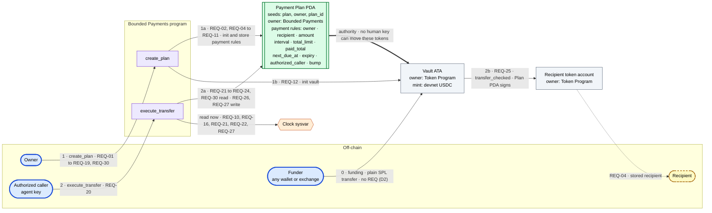

# Deliverable 2: Architecture diagram and requirements

Owner: WalquerX
Reviewers: Wijnaldum, Toto
Status: Draft for team review
Program: Bounded Payments
Repository: https://github.com/ToXMon/bounded-payments

Drafted by the review lane from `docs/architecture.md` at `fc639fc`, the two scope decisions taken in
the review session, and the Capstone Architecture Assignment rubric. The team edits this file, not the
other way round.

## 1. Problem statement

People want software to make routine payments for them. They do not want to approve every payment by
hand, and they do not want to grant unrestricted access to their money. Manual approval removes most of
the value of delegation. Full wallet access turns one error or one compromised key into a large loss.

Bounded Payments is a Solana program that holds funds in a vault and moves them only when a submitted
payment satisfies rules the owner fixed in advance. The owner sets the recipient, the amount, the
interval, the number of payments, the expiry, and one authorized caller key. After that the owner is
out of the loop, and so is anyone holding a key that is not the authorized caller key.

Concrete scenario: a person pays a fixed monthly allowance to one recipient. An agent key submits the
payment each month. If the agent key is stolen, the worst outcome is one scheduled payment, on time, to
an account the owner stored. The thief cannot change the amount, redirect the funds, or empty the vault.

## 2. MVP use cases

The rubric allows one to three use cases and requires **1 use case = 1 atomic state transition = 1 Anchor
instruction handler**. Stage 1 has two.

| Use case | State transition | Handler | Signer | Pass condition |
| --- | --- | --- | --- | --- |
| UC-1 Create a payment plan | One payment plan PDA exists with the payment rules, and its vault exists | `create_plan` | Owner | Valid input creates both accounts. Any invalid input creates nothing. |
| UC-2 Execute a due transfer | Vault balance falls, recipient balance rises, `paid_total` and `next_due_at` update, or nothing changes | `execute_transfer` | Authorized caller | A due transfer succeeds. An early, expired, excessive, redirected, or unauthorized transfer changes nothing. |

Funding the vault is not a program use case. Any wallet or exchange sends devnet USDC to the vault with a
plain SPL Token transfer, and the Token Program enforces the mint. Funding grants no authority. The
red-team recorded the old `deposit` handler as a handler that changed no program state, and the team
removed it (finding F5, ADR 0002).

## 3. Actors

Actor categories carry forward from the team's LOI phase. Signers are marked.

| LOI category | Actor | Signs | Can | Cannot |
| --- | --- | --- | --- | --- |
| Direct actor | Owner | `create_plan` | Define all payment rules. Choose the authorized caller. Pay rent. | Change a plan after creation. |
| Direct actor | Authorized caller (agent key) | `execute_transfer` | Submit a due transfer. Decide when to submit. | Change rules, choose the amount or recipient, withdraw the vault. |
| Direct actor | Funder (any wallet or exchange) | SPL Token transfer, not a program handler | Add USDC to the vault. | Change rules or gain any authority. |
| Beneficiary | Recipient | Does not sign | Receive USDC. | Trigger a payment. |
| Administrator | Owner, for his own plan only | `create_plan` | Set the rules once. | Administer another owner's plan. There is no protocol-level administrator in Stage 1. |
| Stakeholder | Team | No handler | Hold the program upgrade authority on devnet. | Move plan funds. |
| Stakeholder | Circle (USDC issuer) | No handler | Freeze any USDC token account, including the vault. | Move plan funds. |
| Trigger | Agent or scheduler | Does not sign | Cause an authorized caller to submit an instruction. | Bypass any on-chain check. |

Outside the trust boundary: the agent or scheduler process and the web UI. They can submit transactions.
They cannot change what the program verifies.

## 4. Atomic requirements

Each requirement has one action and one testable condition. Full text and the test for each row live in
`docs/requirements.md`. Stage 1 is REQ-01 to REQ-30: REQ-01 to REQ-19 and REQ-30 for `create_plan`,
REQ-20 to REQ-29 for `execute_transfer`.

The design decisions that produced them are D1 to D12 in `docs/architecture.md` section 2.

Decisions first, then requirements:

| Decision | What it fixes | Requirements |
| --- | --- | --- |
| D1 | One stored authorized caller, chosen by the owner | REQ-09, REQ-18 |
| D2 | Funding is not a program use case | none |
| D3, D4, D9 | Clock time, fixed interval, optional first due date, one payment per interval, missed intervals are lost | REQ-10, REQ-16, REQ-21, REQ-22, REQ-27 |
| D5 | Devnet USDC, accessed through `TokenInterface` | REQ-03, REQ-17 |
| D6 | `create_plan` creates the vault, owner pays rent | REQ-01, REQ-12 |
| D7, D8 | Payment rules never change, so bad input is rejected at creation | REQ-13 to REQ-18, REQ-30 |
| D10, D11 | The program derives `total_limit` and `expiry`; all arithmetic is checked | REQ-07, REQ-08, REQ-19, REQ-28 |

## 5. Overview diagram

Every arrow is numbered, names its handler, and carries its REQ ids. The legend and the other three
diagrams are in `docs/architecture.md` section 7.

The heavy edge from the plan PDA to the vault is the design. The vault's authority is a program-derived
address that no person controls, so the authorized caller can request a payment and can never move funds
on its own.

## 6. Flow diagrams

One flow per handler. Every decision shows both branches, and every failure path reaches one error node.

### `create_plan`

Owner signs, then the program checks in this order. Each failed check fails the transaction and creates
no account.

| Check | REQ |
| --- | --- |
| Is the mint the devnet USDC mint? | REQ-03 |
| Does the recipient token account hold that mint? | REQ-17 |
| Does the plan PDA for these seeds not exist yet? | REQ-01, REQ-30 |
| Is the amount non-zero? | REQ-13 |
| Is the interval at least 1? | REQ-14 |
| Is the payment count non-zero? | REQ-15 |
| Was `first_due_at` given? No: use `now`. Yes: is it at or after `now`? | REQ-10, REQ-16 |
| Is the authorized caller non-zero? | REQ-18 |
| Do the computed fields fit without overflow? | REQ-19 |

Then the program creates the plan PDA, stores the payment rules, computes `total_limit` and `expiry`,
sets `paid_total` to 0 and `next_due_at`, and creates the vault with the plan PDA as authority (REQ-02,
REQ-04 to REQ-12). Drawn as diagram D2 in `docs/architecture.md`.

### `execute_transfer`

Authorized caller signs. Seven decisions, each with a failure path into the shared error node.

1. Signer is the stored authorized caller? No: fail (REQ-20).
2. `now ≥ next_due_at`? No: fail (REQ-21).
3. `now ≤ expiry`? No: fail (REQ-22).
4. `paid_total + amount ≤ total_limit`? No: fail (REQ-23).
5. Recipient account is the stored recipient? No: fail (REQ-24).
6. Vault balance at least `amount`? No: fail with the Token Program error (REQ-25).
7. Checked math holds? No: fail (REQ-28).

Then `transfer_checked` moves the amount from the vault to the recipient, signed by the plan PDA (REQ-25),
`paid_total` grows (REQ-26), and `next_due_at` becomes the first scheduled time after `now` (REQ-27).
Any failure leaves every balance and every plan field unchanged (REQ-29).

### A late call

Plan with `amount` 10, `interval` 10, `payment_count` 3: payments due at 100, 110, and 120, `expiry` 130.

| Call lands at | Result | `next_due_at` after |
| --- | --- | --- |
| 100 | One payment | 110 |
| 125 | One payment. The 110 and 120 slots are gone. Late does not stack. | 130 |
| 131 | Rejected. Past `expiry`. | 130, unchanged |

`k = (now − next_due_at) / interval + 1`, integer division, then `next_due_at = next_due_at + k × interval`.

## 7. On-chain requirements matrix

One program PDA, three token accounts, two handlers, six external dependencies. Program IDs are listed
because `AGENTS.md` requires accepting only known program IDs for CPI.

| Account | Type | Owner | Authority | Seeds or derivation | Fields |
| --- | --- | --- | --- | --- | --- |
| Payment plan | PDA | Bounded Payments | Program | `["plan", owner, plan_id]`, canonical bump | `owner: Pubkey`, `plan_id: u64`, `recipient: Pubkey`, `amount: u64`, `interval: i64`, `total_limit: u64`, `paid_total: u64`, `next_due_at: i64`, `expiry: i64`, `authorized_caller: Pubkey`, `bump: u8` |
| Vault | Token account (ATA) | Token Program | Payment plan PDA | ATA of (plan PDA, USDC mint) | USDC balance |
| Recipient token account | Token account | Token Program | Recipient | Given by the owner, stored, re-checked on every transfer | USDC balance |
| USDC mint | Mint | Token Program | Circle | Program constant `4zMMC9srt5Ri5X14GAgXhaHii3GnPAEERYPJgZJDncDU` | 6 decimals, freeze authority Circle |

| Handler | Signer | CPIs | Account constraints | REQ |
| --- | --- | --- | --- | --- |
| `create_plan` | Owner, pays rent | System Program (create plan), Associated Token Program (create vault) | `init` plan PDA with seeds; `mint == USDC_DEVNET`; `recipient.mint == USDC_DEVNET`; vault `init` with authority = plan PDA; `TokenInterface` for mint and accounts | REQ-01 to REQ-19, REQ-30 |
| `execute_transfer` | Authorized caller | `TokenInterface` `transfer_checked`; plan PDA signs with seeds | `caller == plan.authorized_caller`; `recipient == plan.recipient`; vault == ATA(plan, mint); re-derive and check the bump; time, limit, and overflow checks in the handler | REQ-20 to REQ-29 |

Anchor 0.31, per `AGENTS.md`.

| Dependency | Program ID | Used by |
| --- | --- | --- |
| SPL Token Program (classic) | `TokenkegQfeZyiNwAJbNbGKPFXCWuBvf9Ss623VQ5DA` | `execute_transfer`, funding |
| Associated Token Program | `ATokenGPvbdGVxr1b2hvZbsiqW5xWH25efTNsLJA8knL` | `create_plan` |
| System Program | `11111111111111111111111111111111` | `create_plan` |
| Clock sysvar | `SysvarC1ock11111111111111111111111111111111` | Both handlers |
| Rent sysvar | `SysvarRent111111111111111111111111111111111` | Both `init` constraints |
| Circle (USDC issuer) | off-chain authority | Can freeze any USDC account, including the vault |
| Agent or scheduler | off-chain process | Submits `execute_transfer` |
| Web UI | off-chain client | Builds `create_plan` |

## 8. Granularity self-check

Run by the team before any AI tooling, as the rubric requires. It first ran on three handlers; the
red-team pass later removed `deposit`.

| Rule | `create_plan` | `execute_transfer` |
| --- | --- | --- |
| 1. Atomicity | Pass. One handler. It creates the plan PDA and the vault together; both succeed or both fail. | Pass. One handler. Checks, transfer, and state update commit together. |
| 2. State ownership | Pass. Plan PDA is program-owned. Vault is owned by the Token Program with the plan PDA as authority. No off-chain state. | Pass. Writes the plan PDA, the vault, and the recipient token account. No off-chain state. |
| 3. Real signers | Pass. The owner signs. | Pass. The authorized caller signs. That key decides only when to submit. |
| 4. On-chain vs client | Pass. On-chain: input checks, computed fields, account creation. Client: choosing the values, building the transaction. | Pass. On-chain: caller, time, limit, and recipient checks, the transfer, the state update. Client: deciding when to submit. |

Off-chain (client): the agent or scheduler, the web UI, plan value selection, notifications.

## 9. AI red-team record

The red-team pass ran after the self-check, against three handlers. Eight findings came back. The team
accepted five and rejected three, two of those with its own alternative. Full table:
`docs/architecture.md` section 9.

| ID | Finding | Decision |
| --- | --- | --- |
| F1 | `interval` is `i64`, so a negative value passes a "not 0" check | Accept. REQ-14 rejects `interval ≤ 0`. |
| F2 | `next_due_at` math can overflow `i64` | Accept. REQ-19 and REQ-28 use checked math. |
| F3 | Nothing funds the caller key for transaction fees | Reject. The owner tops up that key. Assumption A2. |
| F4 | Make `execute_transfer` permissionless so late calls cannot miss | Reject. The owner chooses and trusts one caller; in Stage 2 the agent's discretion is the product. REQ-20 stays. |
| F5 | `deposit` changes no program state | Accept. Handler removed. Stage 1 is two handlers. ADR 0002. |
| F6 | `first_due_at = now` can fail because the transaction lands later | Reject with an alternative: the owner leaves `first_due_at` empty to mean now. D9, REQ-10, REQ-16. |
| F7 | `total_limit` can be unreachable before `expiry` | Accept with an alternative: derive the fields instead of checking them. D10, REQ-07, REQ-08. |
| F8 | The recipient can close its account, or Circle can freeze it | Accept as known limitation L2. |

## 10. Assumptions and limitations

| ID | Assumption |
| --- | --- |
| A1 | The program never executes by itself. Each payment needs a signed `execute_transfer`. |
| A2 | The owner keeps the authorized caller key funded with SOL for fees. |
| A3 | The authorized caller submits on time. A late submission makes the recipient miss that payment. |

| ID | Limitation | Roadmap fix |
| --- | --- | --- |
| L1 | Tokens left in the vault after `expiry` stay locked, and the owner's rent is not returned. | `close_plan` |
| L2 | If the recipient closes its account, or Circle freezes the vault or the recipient account, every transfer fails. | None planned |
| L3 | A plan cannot change after creation. | Plan updates |

## 11. Milestones and roadmap

1. Week 1: `create_plan`, all input checks, positive and negative tests for REQ-01 to REQ-19 and REQ-30.
2. Week 2: `execute_transfer`, all checks, positive and negative tests for REQ-20 to REQ-29.
3. Stage 2 starts only after every Stage 1 test passes.

Roadmap, not in the POC: `close_plan`; Stage 2 approved purchases (REQ-40 to REQ-46); plan updates;
calendar schedules; Token-2022; multiple callers and key rotation; threshold confirmation; passkey owner
approval; multiple recipients; pause and resume; receipt indexer; x402 integration.

## 12. Resolved decisions

All four questions this section used to hold are now decided.

| Question | Decision | Where |
| --- | --- | --- |
| Who can act as the authorized caller? | One stored key, chosen by the owner. The zero key is rejected. | D1, REQ-09, REQ-18 |
| Does a late transfer skip or catch up? | It skips. One payment per interval, then the first scheduled time after `now`. | D4, REQ-27 |
| Which token does the POC use? | Devnet USDC, classic program, accessed through `TokenInterface`. | D5, ADR 0002 |
| Can the owner change an active plan? | No. Immutability is why every invalid input is rejected at creation. | D7, D8, L3 |

## 13. Individual reflections

The rubric collects these as a separate document per member, not inside the group deliverable. Each
member writes one paragraph: contribution, one AI red-team suggestion they rejected or replaced, and
why. Section 9 rows F4, F6, and F7 carry team overrides each member can draw from.

- WalquerX: to write
- Wijnaldum: to write
- Toto: to write
